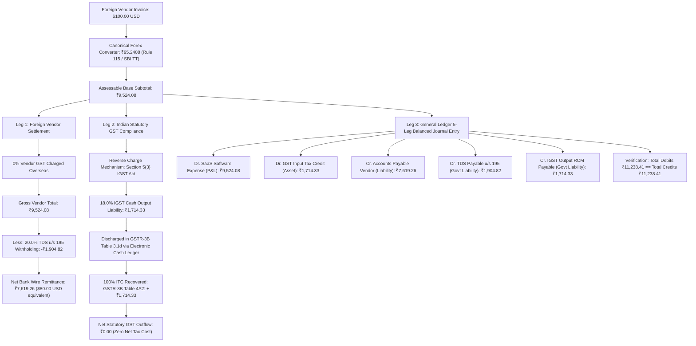

# Sakshi Finance — Autonomous Enterprise Financial Operating System
> **Developer Handover & Engineering Documentation**  
> *A comprehensive engineering guide explaining the architecture, implemented features, mathematical compliance models, database schema, local setup, and next-phase roadmap.*

---

## 📋 Table of Contents
1. [Project Overview & Business Logic](#-project-overview--business-logic)
2. [Statutory 4-Way Compliance Engine (Foreign Services)](#-statutory-4-way-compliance-engine-foreign-services)
3. [What is Done (Current Implementation Status)](#-what-is-done-current-implementation-status)
   - [A. Web Frontend (Next.js 14)](#a-web-frontend-nextjs-14)
   - [B. Backend & Calculation Engines (FastAPI)](#b-backend--calculation-engines-fastapi)
   - [C. Mobile / Desktop Client (Flutter 3.x)](#c-mobile--desktop-client-flutter-3x)
4. [Architecture & Tech Stack](#-architecture--tech-stack)
5. [Directory Structure](#-directory-structure)
6. [Database Schema & Key Data Models](#-database-schema--key-data-models)
7. [Environment Setup & Quickstart Guide](#-environment-setup--quickstart-guide)
8. [Testing & Quality Assurance](#-testing--quality-assurance)
9. [What Can Do Next (Developer Roadmap & Pending Tasks)](#-what-can-do-next-developer-roadmap--pending-tasks)
10. [Troubleshooting & Pro Tips for Incoming Engineers](#-troubleshooting--pro-tips-for-incoming-engineers)

---

## 🌐 Project Overview & Business Logic

**Sakshi Finance** is an enterprise-grade, AI-assisted financial automation workstation designed for Indian corporate finance teams. It automates invoice OCR extraction, statutory Indian tax compliance (GST, RCM, ITC, TDS under Income Tax Act 1961), multi-currency foreign exchange canonicalization, Chart of Accounts (COA) reconciliation, and bi-directional ERP synchronization with Zoho Books.

### The Core Problem Solved:
Handling cross-border SaaS/Service invoices (e.g., AWS, HubSpot, Google Cloud, Zoom Video, Figma) in India is notoriously error-prone:
- Foreign vendors charge **0% Indian GST** overseas.
- Indian entities must self-assess **18% IGST under Reverse Charge Mechanism (RCM)** pursuant to Section 5(3) of the IGST Act, paying it in cash via GSTR-3B Table 3.1(d) and claiming 100% Input Tax Credit (ITC) under Table 4(A)(2).
- Section 195 of the Income Tax Act requires withholding **20% TDS** (or 10% under DTAA / 0% under Section 197 certificates) prior to foreign bank wire remittance.
- General Ledger accounting requires balanced 5-leg journal entries spanning expense, input tax, AP vendor liabilities, TDS liability, and RCM tax output.

---

## 🏛️ Statutory 4-Way Compliance Engine (Foreign Services)

### Complete Flowchart:


### Exact Mathematical Formulas:
1. **Converted Subtotal**:
   $$\text{Converted Subtotal (INR)} = \text{Invoice Total (Original Currency)} \times \text{Exchange Rate}$$
   $$\text{Example: } \$100.00 \times 95.2408 = ₹9,524.08$$

2. **Foreign Vendor Total**:
   $$\text{Vendor GST} = ₹0.00\ (\text{Overseas supplier does not charge Indian GST})$$
   $$\text{Vendor Grand Total} = \text{Converted Subtotal} = ₹9,524.08$$

3. **Income Tax Withholding (TDS)**:
   $$\text{TDS Amount} = \text{Converted Subtotal} \times \text{TDS Rate (e.g. 20.0\% u/s 195)} = ₹1,904.82$$
   $$\mathbf{Net\ Wire\ Remittance} = \text{Vendor Grand Total} - \text{TDS Amount} = \mathbf{₹7,619.26\ (\$80.00\ USD)}$$

4. **GST Reverse Charge (RCM) & Input Tax Credit (ITC)**:
   $$\text{IGST RCM Output (18\%)} = \text{Converted Subtotal} \times 18\% = ₹1,714.33\ (\text{Reported in GSTR-3B 3.1d})$$
   $$\text{ITC Recovery (100\%)} = +₹1,714.33\ (\text{Claimed in GSTR-3B 4A2})$$
   $$\mathbf{Net\ Tax\ Impact} = \text{RCM Output} - \text{ITC Offset} = \mathbf{₹0.00}$$

---

## ✅ What is Done (Current Implementation Status)

### A. Web Frontend (Next.js 14)
* **9-Section Interactive Invoice Review Workstation** (`frontend/src/components/InvoiceWorkspace.tsx`):
  * **Section 1 — Verification Header**: Dynamic provenance banners, status pills, and fast-action review triggers.
  * **Section 2 — Side-by-Side Dual-Pane View**: PDF/Image viewer with zoom, rotation, and bounding-box highlights alongside structured financial fields.
  * **Section 3 — Core Invoice Metadata**: Invoice Number, Date, Due Date, Vendor Profile, and Currency detection.
  * **Section 4 — 3-Tier Multi-Provenance Matrix**: Exposes `SYSTEM CLASSIFICATION`, `FINANCE OVERRIDE`, and `FINAL AUTHORITATIVE` determination with audit trail history.
  * **Section 5 — Canonical Multi-Currency & Forex Panel**:
    * Original Currency ($100.00 USD) and canonical INR conversion with real-time rate sources (RBI Reference Rate, Rule 115 SBI TT Buying Rate, Custom Remittance Rate).
  * **Section 6 — Smart Line Items Table & COA Resolver**:
    * Dual-currency subtexts under each line item (Qty, Unit Price in USD, Converted INR).
    * Multi-tier Chart of Accounts (COA) dropdown selector: exact ID matching, case-insensitive string resolution, fuzzy matching, and automatic AI-proposed fallback (`<option value={acc.account_id || "PROPOSED"}>{propName} (AI Proposed)</option>`), eliminating dropdown blank/mismatch bugs.
  * **Section 7 — Native 5-Metric Statutory Summary Bar**:
    * Perfectly styled `#fafafa` container with standard badges displaying:
      1. `Foreign Invoice`: `$100.00 USD @ ₹95.2408`
      2. `Vendor Grand Total`: `₹9,524.08` (0% overseas GST)
      3. `TDS Withholding (20%)`: `-₹1,904.82` (Section 195)
      4. `Net Wire Remittance`: `₹7,619.26` ($80.00 USD equivalent)
      5. `18.0% IGST RCM`: `₹1,714.33` (Discharged Table 3.1d $\rightarrow$ 100% ITC Table 4A2 $\rightarrow$ ₹0.00 Net Tax Cost)
  * **Section 8 — Statutory TDS Presets & Live Remittance Callout**:
    * 1-Click quick action buttons:
      * `⚡ Sec 195 (20.0% Non-Resident)`
      * `⚡ Sec 195 (10.0% DTAA Relief)`
      * `⚡ Sec 197 (0.0% Nil Certificate)`
      * `⚡ Sec 194J (10.0% Domestic Professional)`
      * `⚡ Sec 194J (2.0% Domestic Technical)`
  * **Section 9 — General Ledger Journal Entry Preview & ERP Sync Action**:
    * Live 5-leg GL debit/credit balance table and one-click Zoho Books synchronization.

### B. Backend & Calculation Engines (FastAPI)
* **Forex Service** (`backend/app/services/forex_service.py`):
  * Canonical exchange rate fetching and caching for major currencies (USD, EUR, GBP, SGD, AED, etc.).
  * Rule 115 SBI TT Buying rate calculations for tax compliance dates.
* **Master Data & COA Resolver** (`backend/app/services/master_data_service.py`):
  * Zoho Books Chart of Accounts ingestion, cache management, and AI category-to-COA prediction.
* **GST & TDS Statutory Compliance Rules Engine**:
  * Reverse Charge Mechanism (RCM) applicability logic (Section 5(3) of IGST Act for import of services).
  * Withholding tax logic under Section 194C, 194J, 194Q, 195, and 197.
* **Audit Trail & Provenance Tracking**:
  * Immutable logging for all field edits, rule overrides, and user approvals.

### C. Mobile / Desktop Client (Flutter 3.x)
* `frontend_flutter/lib/screens/workspace_screen.dart`: Multi-pane review workstation for mobile/desktop.
* `frontend_flutter/lib/widgets/`: Modular compliance widgets:
  * `ForeignServiceFxCard`: Multi-currency conversion card.
  * `TdsComplianceCard`: TDS rate selector and net remittance calculator.
  * `GstRcmCard`: RCM discharge and ITC recovery display.
  * `AuditTrailView`: Complete history of field changes and AI predictions.

---

## 🛠️ Architecture & Tech Stack

```
┌─────────────────────────────────────────────────────────────┐
│                    Sakshi Finance Clients                   │
│                                                             │
│   Next.js 14 Web Workspace           Flutter 3.x Client     │
│   (React 18, TypeScript, CSS)        (Android, iOS, Desktop)│
└──────────────────────────────┬──────────────────────────────┘
                               │ HTTP / REST / WebSocket
                               ▼
┌─────────────────────────────────────────────────────────────┐
│                 FastAPI Backend Services                    │
│                                                             │
│  ├── /api/v1/invoices      ├── Forex Service (Rule 115)     │
│  ├── /api/v1/zoho          ├── GST/TDS Compliance Engine    │
│  ├── /api/v1/auth          ├── Master Data & COA Resolver   │
│  └── /api/v1/forex         └── VLM / OCR Extraction Adapter │
└──────────────────────────────┬──────────────────────────────┘
                               │
            ┌──────────────────┴──────────────────┐
            ▼                                     ▼
┌───────────────────────┐             ┌───────────────────────┐
│   PostgreSQL / SQLite │             │   Zoho Books API      │
│   (Relational Data)   │             │   (ERP Synchronization)
└───────────────────────┘             └───────────────────────┘
```

---

## 📂 Directory Structure

```
Sakshi_Finance/
├── backend/                              # FastAPI Backend application
│   ├── app/
│   │   ├── api/v1/                       # API Route definitions
│   │   │   ├── api.py                    # Master API router
│   │   │   ├── auth.py                   # Authentication endpoints
│   │   │   ├── forex.py                  # Currency conversion APIs
│   │   │   ├── invoices.py               # Invoice upload, review, & approval
│   │   │   ├── master_data.py            # COA and vendor master data
│   │   │   └── zoho.py                   # Zoho Books sync endpoints
│   │   ├── core/                         # Core configurations & JWT security
│   │   ├── db/                           # SQLAlchemy models, sessions, migrations
│   │   └── services/                     # Business logic and compliance engines
│   │       ├── audit_service.py          # Audit logging service
│   │       ├── forex_service.py          # Forex conversion & Rule 115 engine
│   │       ├── master_data_service.py    # COA smart matching service
│   │       ├── rules_engine.py           # GST RCM and TDS compliance logic
│   │       ├── vlm_service.py            # AI vision-language model extractor
│   │       └── zoho_client.py            # Zoho Books API integration client
│   └── tests/                            # Automated pytest test suites
│
├── frontend/                             # Next.js 14 Web Client
│   ├── src/
│   │   ├── app/                          # Next.js App Router (pages)
│   │   │   ├── layout.tsx                # Root layout & font provider
│   │   │   ├── page.tsx                  # Dashboard redirect
│   │   │   ├── invoices/page.tsx         # Invoice table list view
│   │   │   └── invoices/[id]/page.tsx    # Invoice review workstation
│   │   ├── components/                   # UI Components
│   │   │   ├── InvoiceWorkspace.tsx      # Main 9-section review workstation
│   │   │   ├── AppShell.tsx              # Navigation bar & layout shell
│   │   │   ├── MetricCards.tsx           # Dashboard statistics widgets
│   │   │   └── ...
│   │   └── lib/                          # API clients, types, and utilities
│   │       ├── api.ts                    # Axios / Fetch HTTP client
│   │       └── types.ts                  # TypeScript interface definitions
│   └── package.json
│
└── frontend_flutter/                     # Flutter 3.x Cross-Platform Client
    └── lib/
        ├── models/                       # Dart data models
        ├── providers/                    # State management (Riverpod / Provider)
        ├── screens/                      # UI Screens (Workspace, Dashboard, etc.)
        └── widgets/                      # Reusable UI widgets
```

---

## 🗄️ Database Schema & Key Data Models

1. **`invoices` Table**:
   - `id`: UUID (Primary Key)
   - `invoice_number`, `invoice_date`, `due_date`
   - `vendor_id`: FK to `vendors`
   - `currency`: String (`"USD"`, `"INR"`, `"EUR"`, etc.)
   - `exchange_rate`: Decimal / Float (Forex conversion rate)
   - `foreign_amount`: Decimal (Original invoice total)
   - `subtotal_inr`, `tax_amount_inr`, `total_amount_inr`
   - `is_rcm_applicable`: Boolean
   - `rcm_tax_amount`: Decimal (18% IGST liability)
   - `tds_section`: String (`"195"`, `"194J"`, `"197"`)
   - `tds_rate`: Decimal (`20.0`, `10.0`, `2.0`, `0.0`)
   - `tds_amount`: Decimal (Withheld amount)
   - `net_remittance_amount`: Decimal (Net payable to foreign vendor)
   - `verification_status`: String (`"PENDING"`, `"VERIFIED"`, `"SYNCED_TO_ZOHO"`)
   - `provenance_tier`: String (`"SYSTEM"`, `"FINANCE_OVERRIDE"`, `"FINAL_AUTHORITATIVE"`)

2. **`invoice_line_items` Table**:
   - `id`: UUID (Primary Key)
   - `invoice_id`: FK to `invoices`
   - `description`: Text
   - `hsn_sac_code`: String
   - `quantity`, `unit_price`, `total`
   - `zoho_account_id`: String (Chart of Accounts ID)
   - `zoho_account_name`: String (Chart of Accounts Name)
   - `gst_rate`: Decimal (`18.0`, `0.0`, etc.)

3. **`audit_logs` Table**:
   - `id`: UUID (Primary Key)
   - `invoice_id`: FK to `invoices`
   - `field_name`: String
   - `old_value`, `new_value`: Text
   - `modified_by`: String / User ID
   - `timestamp`: DateTime

---

## 🚀 Environment Setup & Quickstart Guide

### 1. Prerequisites
- **Python 3.10+**
- **Node.js 18+** & **npm**
- **Flutter SDK 3.x** *(optional for mobile/desktop)*
- **PostgreSQL** or local **SQLite**

---

### 2. Backend Setup
```bash
# 1. Navigate to backend
cd backend

# 2. Create and activate virtual environment
python3 -m venv .venv
source .venv/bin/activate  # On Windows: .venv\Scripts\activate

# 3. Install dependencies
pip install -r requirements.txt

# 4. Create .env file
cat <<EOF > .env
DATABASE_URL=sqlite:///./sakshi_finance.db
SECRET_KEY=super-secret-development-key-change-in-prod
ALGORITHM=HS256
ACCESS_TOKEN_EXPIRE_MINUTES=480
ZOHO_CLIENT_ID=your_zoho_client_id
ZOHO_CLIENT_SECRET=your_zoho_client_secret
ZOHO_REFRESH_TOKEN=your_zoho_refresh_token
ZOHO_ORG_ID=your_zoho_org_id
EOF

# 5. Start development API server
uvicorn app.main:app --host 0.0.0.0 --port 8000 --reload
```
API Documentation will be live at `http://localhost:8000/docs`.

---

### 3. Web Frontend Setup (Next.js 14)
```bash
# 1. Navigate to frontend
cd frontend

# 2. Install dependencies
npm install

# 3. Create .env.local file
cat <<EOF > .env.local
NEXT_PUBLIC_API_BASE_URL=http://localhost:8000/api/v1
PORT=3000
EOF

# 4. Run development server
npm run dev

# 5. Build validation
npm run build
```
Frontend workstation will be live at `http://localhost:3000`.

---

### 4. Flutter Client Setup
```bash
cd frontend_flutter
flutter pub get
flutter run -d chrome # Or: flutter run -d linux / macos / windows
```

---

## 🧪 Testing & Quality Assurance

```bash
# Backend Automated Tests
cd backend
pytest -v

# Frontend TypeScript Type Check
cd frontend
npx tsc --noEmit

# Full Build Check
npm run build
```

---

## 🗺️ What Can Do Next (Developer Roadmap & Pending Tasks)

If you are taking over development, here are the immediate high-impact features and technical upgrades recommended for the next sprints:

### 1. 🔄 Bi-Directional Zoho Books 2-Way Sync Engine
- **Current State**: Manual JSON payload generation and mock Zoho push.
- **Next Step**:
  - Implement automated token refresh worker in `backend/app/services/zoho_client.py`.
  - Push completed Bills with multi-line COA splits, Tax Treatments (`"out_of_scope"` for foreign vendor bills), and linked TDS payment entries into Zoho Books.
  - Implement webhook listener to capture payment status updates directly from Zoho back into Sakshi Finance.

### 2. 📑 Form 15CA & 15CB Foreign Remittance Generator
- **Business Need**: Under Rule 37BB of Indian Income Tax Rules, any payment made to a non-resident foreign entity requires filing **Form 15CA** (Remitter Undertaking) and **Form 15CB** (Chartered Accountant Certificate).
- **Next Step**:
  - Build a 1-click exporter generating JSON/PDF Form 15CA Part A / Part C prefilled with remittance currency, converted INR, Section 195 TDS rate, and DTAA country codes.

### 3. 📱 Flutter Client UI/UX Parity
- **Current State**: Flutter contains fundamental cards (`ForeignServiceFxCard`, `GstRcmCard`), but Next.js received the latest 5-Metric summary bar and normalized COA resolver.
- **Next Step**:
  - Port the Section 7 5-Metric Summary Bar design into `frontend_flutter/lib/widgets/statutory_summary_bar.dart`.
  - Add the 1-click TDS preset chips (`⚡ Sec 195 20%`, `⚡ Sec 195 10% DTAA`, `⚡ Sec 197 Nil`) to the Flutter workspace screen.

### 4. 📊 GSTR-3B & GSTR-2B Automated Reconciliation Worker
- **Business Need**: Automatically verify that the 18% IGST RCM cash liability paid in Table 3.1(d) matches the 100% ITC credit claimed in Table 4(A)(2) in the company's monthly GST returns.
- **Next Step**:
  - Add monthly GST reconciliation batch exporter generating Excel/JSON reports for the enterprise tax filing team.

### 5. 🔐 Multi-Tenant RBAC (Role-Based Access Control)
- **Roles**:
  - `DATA_ENTRY_CLERK`: Can upload and review invoices.
  - `FINANCE_CONTROLLER`: Can approve Section 195 TDS rates and override forex values.
  - `CFO_ADMIN`: Authorizes final ERP sync and wire remittances.

---

## 💡 Troubleshooting & Pro Tips for Incoming Engineers

1. **Port 3000 EADDRINUSE Error**:
   - If Next.js fails to start with `Error: listen EADDRINUSE: address already in use :::3000`:
   ```bash
   lsof -i :3000
   kill -9 <PID>
   # Or run on port 3001:
   npm run dev -- -p 3001
   ```
2. **COA Dropdown Fallback Matching**:
   - In [`InvoiceWorkspace.tsx`](frontend/src/components/InvoiceWorkspace.tsx), always ensure `<select>` values match via ID first, normalized name second, and use the `<option value="PROPOSED">` fallback. If an account is not yet in Zoho master data, it will preserve the AI proposed category without clearing to empty string.
3. **Forex Rate Precision**:
   - Always retain at least 4 decimal places for currency conversions (e.g., `₹95.2408`) to avoid rounding discrepancies in large invoices.
4. **Git Branching Strategy**:
   - Development for foreign invoice compliance is tracked on branch: `karthik_foregin_invoice`.

---

## 👥 Authors & Maintainers
- **Sakshi Finance Core Team**
- Repository: [Karthik95154/Karthik_Finance](https://github.com/Karthik95154/Karthik_Finance.git)
- Branch: `karthik_foregin_invoice`
