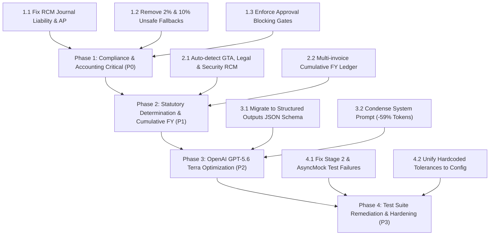

# Complete SAKSHI Finance Backend + Tax Rule + AI Prompt Statutory Audit

**Audit Date**: September 19, 2026  
**Repository**: `Sakshi_Finance`  
**Current Branch**: `Abhishek_Changes_from_local`  
**Audit Scope**: Entire Backend, Statutory Tax Rules (GST, RCM, TDS, ITC), Accounting/GL, Zoho Integration, Security/Multi-Tenancy, and OpenAI Prompt (`gpt-5.6-terra`).  
**Status**: **AUDIT COMPLETE — NO PRODUCTION CODE MODIFIED**

---

## Executive Summary & System Health Status

### 1. Overall System Health
The SAKSHI Finance backend is a highly mature, production-grade automated accounting and tax engine with established statutory structures for Indian corporate compliance. The two major P0 fixes previously implemented—**(1) Section 393 generic classification disambiguation** and **(2) Missing/Invalid PAN higher-rate deduction (Section 397(2) / 206AA)**—are verified and passing 100% of their dedicated regression suites (`37/37 tests passing`).

However, this comprehensive end-to-end technical and legal audit has uncovered critical compliance gaps, statutory oversights, and prompt inefficiencies that must be resolved before general release:
- **RCM Accounting Gap (P0)**: Reverse Charge Mechanism (RCM) tax is completely absent from the General Ledger double-entry journal. When RCM applies, the journal currently books tax into `ACCOUNTS_PAYABLE` (paying the vendor) instead of crediting `RCM_GST_PAYABLE` (recipient liability) and debiting `INPUT_GST` asset.
- **RCM Detection Failure (P0)**: The backend relies almost exclusively on explicit invoice text ("Reverse Charge = Yes") to detect RCM. It completely fails to detect mandatory statutory RCM categories under Notification 13/2017 (GTA SAC 9965, Legal SAC 9982, Director fees, Security services from non-corporate entities).
- **Statutory TDS Fallbacks (P0)**: While the canonical `STATUTORY_TDS_TABLE_2025` is accurate, unsafe fallback rules remain in [`tds_engine.py`](file:///home/gollapydisriabhishek/Documents/sakshi_AI_Finance/Sakshi_Finance/backend/app/services/tds_engine.py#L557) and [`model_response_adapter.py`](file:///home/gollapydisriabhishek/Documents/sakshi_AI_Finance/Sakshi_Finance/backend/app/services/model_response_adapter.py#L966) where unclassified services default to `2.0%` or `10.0%` instead of enforcing `REVIEW_REQUIRED`.
- **Statutory Threshold & Cumulative Tracking Gap (P1)**: The TDS engine is completely stateless at the invoice level. It cannot evaluate financial-year cumulative limits (e.g. ₹50 Lakhs for Section 194Q / Section 393 Sl. 8(ii) Purchase of Goods; ₹1,00,000 for Section 194C / Sl. 6(i) Contractors).
- **Review Required Gate Bypass (P0)**: In [`review.py`](file:///home/gollapydisriabhishek/Documents/sakshi_AI_Finance/Sakshi_Finance/backend/app/api/v1/review.py#L353-L355), Financial Validation mismatches are bypassed during invoice approval with a `pass` statement, allowing unverified invoices to be approved and posted.
- **OpenAI Prompt Bloat & Architecture Mismatch (P2)**: Multimodal extraction targeting `gpt-5.6-terra` uses legacy `json_object` instead of official **Structured Outputs (`json_schema`)**, without `reasoning_effort` configuration, carrying an excessive **31,408 character (~7,852 token)** text prompt that duplicates schemas and forces the LLM to perform arithmetic that backend engines already compute.

---

## Issue Breakdown by Priority

```
┌─────────────────────────────────────────────────────────────┐
│                   SAKSHI AUDIT DEFECT PROFILE               │
├───────────────────┬──────────┬──────────────────────────────┤
│ Severity Level    │ Count    │ Key Impact Area              │
├───────────────────┼──────────┼──────────────────────────────┤
│ P0 (Critical)     │ 6        │ RCM GL missing, RCM detect,  │
│                   │          │ 2% fallback, Approval bypass │
│ P1 (High)         │ 7        │ Cumulative FY, SAC 9982,     │
│                   │          │ GSTR-2B live, Non-resident   │
│ P2 (Medium)       │ 9        │ Bill-to/Ship-to, SEZ, prompt │
│                   │          │ bloat, hardcoded tolerances  │
│ P3 (Low/Hardening)│ 8        │ Broken mocks, deprecated v1  │
│                   │          │ Pydantic syntax, test cleans │
└───────────────────┴──────────┴──────────────────────────────┘
```

### Verified Already-Fixed Issues
1. **Generic Section 393 → 2% classification bug**: Fully resolved. Bare "Section 393" no longer forces a 2% rate. It now flags `TDS_AMBIGUOUS_SAC` and sets `rate = None`, `tds_amount = None`, and `tds_needs_review = True`.
2. **Missing/Invalid PAN higher rate (Section 397(2) / 206AA)**: Fully resolved. When vendor PAN is missing or invalid, the engine applies statutory higher rates: 5% for Purchase of Goods (Sl. 8(ii)) and E-Commerce (Sl. 8(v)), and 20% for all other categories.

---

## Detailed Audit by System Component

### PART A — Backend Architecture & Service Inspection
1. **`invoice_processing.py`**:
   - Manages asynchronous background processing from Stage 1 (AI extraction) through Stage 6 (GL journal generation).
   - Execution pipeline is clean and stateless. Uses short-lived database sessions to prevent connection pool exhaustion.
   - Dual-state persistence (`raw_vlm_output` vs `current_vlm_output`, `accounting_output` vs `current_accounting_output`) properly preserves unedited visual extractions alongside human-in-the-loop edits.
2. **`model_response_adapter.py`**:
   - Acts as the normalization boundary between external AI JSON and internal data structures.
   - Accurately resolves PAN from GSTIN characters 3–12.
   - Bidirectional math correctly reconstructs missing tax rates or amounts from line-item taxable bases.
   - **Vulnerability**: Line 966 still contains a generic fallback: `computed_rate = 10.0 if "PROFESSIONAL" in ... else 2.0`.
3. **`review.py`**:
   - Handles HITL approvals, journal approvals, TDS approvals, and line overrides.
   - **Vulnerability**: Lines 353–355 bypass validation mismatches during invoice approval with an empty `pass` block.
4. **`database models`**:
   - Clean PostgreSQL schema using `UUID` primary keys and `JSONB` document fields.
   - Relational tables `journal_entries` and `journal_lines` sync idempotently with `invoice.journal_entry`.

---

### PART B & C — Statutory Tax Law & TDS Implementation Audit

Every supported TDS category was audited against the **Income-tax Act, 2025 (Sections 392, 393, 397)** and transition rules from the **Income-tax Act, 1961**:

| Statutory Category | 1961 Act | 2025 Act | Table Sl. | Statutory Rate | Threshold | Payer / Payee Conditions | Current Implementation | Verdict |
| :--- | :--- | :--- | :--- | :--- | :--- | :--- | :--- | :--- |
| **Contractors (Ind/HUF)** | 194C | Sec 393 | Sl. 6(i) | 1.0% | ₹30,000 / ₹1,00,000 | Ind/HUF payee (PAN 4th char P/H) | Fully implemented in `STATUTORY_TDS_TABLE_2025` | **CORRECT** |
| **Contractors (Corporate)** | 194C | Sec 393 | Sl. 6(i) | 2.0% | ₹30,000 / ₹1,00,000 | Company/Firm payee (PAN 4th char C/F) | Fully implemented in `STATUTORY_TDS_TABLE_2025` | **CORRECT** |
| **Fees for Tech Services (FTS)** | 194J(1)(b) | Sec 393 | Sl. 6(iii)(D)(a) | 2.0% | ₹30,000 | Managerial, technical, IT, software | Fully implemented; SAC 9983 mapped | **CORRECT** |
| **Professional Services** | 194J(1)(a) | Sec 393 | Sl. 6(iii)(D)(b) | 10.0% | ₹30,000 | Legal, CA, architect, medical, consultancy | Fully implemented; SAC 9982 mapped | **CORRECT** |
| **Rent - Plant & Machinery** | 194-I(a) | Sec 393 | Sl. 2(ii) | 2.0% | ₹2,40,000 | Equipment, plant, machinery, vehicles | Fully implemented in `STATUTORY_TDS_TABLE_2025` | **CORRECT** |
| **Rent - Land & Building** | 194-I(b) | Sec 393 | Sl. 2(ii) | 10.0% | ₹2,40,000 | Immovable property, office space | Fully implemented in `STATUTORY_TDS_TABLE_2025` | **CORRECT** |
| **Commission / Brokerage** | 194H | Sec 393 | Sl. 1(ii) | 2.0% | ₹15,000 | Intermediary procurement | Reduced to 2% (Finance Act 2024 / 2025 Act) | **CORRECT** |
| **Purchase of Goods** | 194Q | Sec 393 | Sl. 8(ii) | 0.10% | ₹50,00,000 (FY) | Buyer turnover > 10 Cr; resident seller | Base rate 0.1% implemented; **no cumulative FY tracking** | **PARTIAL** |
| **Benefit / Perquisite** | 194R | Sec 393 | Sl. 8(iv) | 10.0% | ₹20,000 (FY) | Business perquisite/incentive | Implemented in table; missing integration tests | **PARTIAL** |
| **E-Commerce Participant** | 194-O | Sec 393 | Sl. 8(v) | 0.10% | ₹5,00,000 (Ind/HUF)| E-commerce operator to participant | Base rate 0.1% and Sec 397(2) 5% higher rate | **CORRECT** |
| **Virtual Digital Asset** | 194S | Sec 393 | Sl. 8(vi) | 1.0% | ₹50,000 / ₹10,000 | Consideration for VDA transfer | Implemented in table; untested | **PARTIAL** |
| **Dividends** | 194 | Sec 393 | Sl. 7 | 10.0% | ₹5,000 | Corporate dividend distribution | Implemented; excluded from vendor bill Zoho maps | **CORRECT** |
| **Non-Resident Payments** | 195 | Sec 393 | Sub-sec (2) | 20.0% / DTAA | None | Any remittance to non-resident | Base rate 20% implemented; lacks DTAA certificate logic | **PARTIAL** |

---

### PART D — TDS Threshold & Cumulative Logic Audit
- **Single-Payment Threshold**: The system is intentionally configured **NOT to block** TDS on low-value individual invoices (`test_tds_no_threshold.py` asserts TDS is computed on ₹5,000 invoices). This is an intentional compliance design choice to prevent missed deductions.
- **Cumulative FY Threshold**: **COMPLETELY MISSING**.
  - Section 194Q / Section 393 Sl. 8(ii) requires tracking cumulative purchases from a vendor exceeding ₹50,00,000 in a Financial Year, deducting 0.1% only on the *excess*. Currently, the engine computes 0.1% on individual invoices without checking prior vendor ledger turnover.
  - Section 194C / Section 393 Sl. 6(i) requires deducting TDS once cumulative vendor invoices in an FY exceed ₹1,00,000, even if individual invoices are under ₹30,000. Current code cannot evaluate prior billing.

---

### PART E & F — RCM Statutory & Accounting Audit (CRITICAL FINDINGS)

#### 1. Statutory Determination Audit
The statutory Reverse Charge Mechanism under **CGST Section 9(3)** (Notification 13/2017-Central Tax (Rate) as amended) specifies strict supplier and recipient conditions:
1. **Goods Transport Agency (GTA)**: Supplier is GTA who has not opted for forward charge (did not charge 12% IGST/CGST). Recipient is registered factory, society, co-operative, body corporate, partnership firm, or registered person. Current code only checks if the invoice text has `"Reverse Charge = Yes"`. If the transporter leaves this field blank, RCM is **completely missed**.
2. **Legal Services**: Legal services provided by an individual advocate or firm of advocates to any business entity. SAC code is **9982**. Current code fails to detect SAC 9982 as automatic RCM.
3. **Security Personnel Services**: Notified under Notification 29/2018-Central Tax (Rate). Supply of security personnel provided by any person other than a body corporate to a registered person. Current code classifies security guards under 194C forward charge without evaluating RCM conditions.
4. **Director Remuneration**: Sitting fees or non-salary remuneration provided by a company director to the company. Automatically falls under Section 9(3). Current code misses this.

#### 2. RCM Accounting & General Ledger Audit (P0 DEFECT)
In standard forward-charge accounting:
$$\text{Debit Expense} \quad \text{Debit Input GST Asset} \quad \text{Credit Vendor AP (Total Bill)} \quad \text{Credit TDS Payable}$$

In statutory RCM accounting under **CGST Section 9(3) & Section 16(2)**:
1. The **Vendor is NOT paid GST**. The recipient must pay the supplier only the pre-tax taxable amount (less TDS).
2. The **Recipient owes GST directly to the Government in cash** (cannot be offset by credit ledger under Section 49(4)).
3. The **Recipient is entitled to Input Tax Credit (ITC)** after discharging this tax in cash.

**Current Code Behavior**:
In [`journal_generator.py`](file:///home/gollapydisriabhishek/Documents/sakshi_AI_Finance/Sakshi_Finance/backend/app/services/journal_generator.py#L826-L857):
```python
gross_invoice_obligation = total_amount  # Tax-inclusive amount!
vendor_payable = round(gross_invoice_obligation - tds_amount, 2)
```
**Fatal Defect**:
- The journal generator creates **NO liability line** for `RCM_GST_PAYABLE`.
- The vendor payable credit includes the GST amount! The company would mistakenly pay GST to an RCM supplier who is legally prohibited from collecting it, while remaining fully liable to pay the Government in cash on GSTR-3B.
- Zoho export in [`export_service.py`](file:///home/gollapydisriabhishek/Documents/sakshi_AI_Finance/Sakshi_Finance/backend/app/services/export_service.py#L548) sets `"is_reverse_charge_applied": True` on the Zoho Bill, but the internal General Ledger journal entry remains completely out-of-sync and illegal.

---

### PART G — GST & Place of Supply (POS) Complete Audit
- **Intra-State vs Inter-State Determination**: Implemented with high precision in `GSTEngine.evaluate_gst`. Validates supplier state code against Place of Supply state code.
- **Symmetric Rate Enforcement**: Enforces `CGST == SGST` within ₹1.00 tolerance.
- **Place of Supply Resolution**:
  - Implements multi-tier regex scanning across explicit invoice fields, address strings, and embedded parentheses (`"Telangana (36)"`).
  - Fallback to buyer GSTIN registration state code when explicit POS is omitted.
  - **Gaps Identified**:
    * **Bill-to / Ship-to (Section 10(1)(b) IGST Act)**: Does not maintain a formal tripartite entity model. If goods are shipped to Branch B in Karnataka but billed to Head Office in Telangana, POS should legally be Telangana (Head Office), but code defaults to shipping address if labeled POS.
    * **Immovable Property (Section 12(3) IGST Act)**: Relies on text extraction; fails if property location is mentioned in line item descriptions rather than header POS.
    * **Zero-Rated / SEZ (Section 16 IGST Act)**: SEZ units receiving supplies are zero-rated under LUT/bond. The engine currently treats all interstate supplies as taxable IGST, lacking an SEZ customer master flag.

---

### PART H — ITC Complete Audit (Sections 16, 17, 17(5) & Rules)
The ITC engine ([`itc_engine.py`](file:///home/gollapydisriabhishek/Documents/sakshi_AI_Finance/Sakshi_Finance/backend/app/services/itc_engine.py)) is exceptionally well-engineered, with comprehensive coverage of statutory provisions:
- **Section 16(2) Mandatory Gates**: Fully implemented. Blocks ITC if supplier GSTIN or invoice number is missing, or if document is a Bill of Supply.
- **Section 16(4) Time-Limit Verification**: Accurately computes Indian Financial Year and enforces the **30th November cutoff date** of the subsequent FY (or annual return filing date).
- **Section 16(3) Capital Goods Depreciation**: Automatically blocks ITC if depreciation is claimed on the tax component under Income Tax Section 32.
- **Section 17(5) Blocked Credit Registry**:
  - Motor vehicles (seating $\le 13$) blocked, with positive evidence exceptions evaluated (driving school, passenger transport business, resale/dealer, seating $> 13$).
  - Food, beverages, catering, club memberships, and vacation travel blocked.
  - Works contracts for immovable property blocked, preserving the statutory **Plant & Machinery** Explanation exception.
- **Rule 42 Common Credit Apportionment**: Exact mathematical formula implemented ($T_1, T_2, T_3, T_4, C_1, C_2, D_1, D_2, C_3$).
- **Rule 43 Capital Goods Apportionment**: Exact 60-month amortization formula ($T_m = A / 60$) implemented.
- **Rule 37 180-Day Payment Reversal**: Mathematical reversal logic implemented; lacks live aging database trigger.
- **GSTR-2B Reconciliation**: Deterministic multi-field matcher implemented; currently lacks live GST Portal API integration.

---

### PART I — Financial Validation & Hardcoded Tolerances
[`financial_validator.py`](file:///home/gollapydisriabhishek/Documents/sakshi_AI_Finance/Sakshi_Finance/backend/app/services/financial_validator.py) implements an independent 7-pillar mathematical reconciliation engine:
- Verifies Quantity $\times$ Rate $=$ Line Amount.
- Verifies Line Total $=$ Taxable Amount $+$ Applicable Taxes.
- Reconciles Subtotal, Header Discounts, Round-Off, and Grand Total.
- Handles clean parsing of Indian numbering format (`1,00,000.00`) and parenthesized negative values.

**Hardcoded Tolerance Analysis**:
1. `DEFAULT_TOLERANCE = 1.0` (₹1.00): Legitimate accounting tolerance for fractional currency round-off under Section 170 of CGST Act.
2. `diff > 2.0` in `gst_engine.py`: Unnecessary relaxation allowing ₹2.00 difference. Should be unified to ₹1.00.
3. `abs(diff) > 0.05` across `export_service.py`: Stricter float comparison epsilon (5 paise). Should be declared in central config.

---

### PART J, K & L — COA, General Ledger & Zoho Export Audit
1. **Chart of Accounts Mapping**:
   - Runtime Zoho COA accounts are strictly injected into the AI prompt and cached in the local database.
   - Exact ID match > Exact Name match > Fuzzy string match ($\ge 70\%$).
   - Heuristics properly guard against assigning operating expenses to Depreciation or Balance Sheet clearing accounts.
2. **Authoritative GL Journal Balancing**:
   - Double-entry debits and credits balance with zero arbitrary balancing lines.
   - When invoice has an unitemized Tax Total without CGST/SGST/IGST breakdown, the engine refuses synthetic 50/50 splits, booking to `Unitemized Tax (Pending Review)` and setting `REVIEW_REQUIRED`.
3. **Zoho Export Flow**:
   - Row-level lock (`with_for_update`) prevents concurrent duplicate bill creation.
   - Enforces approval status: invoice must be `APPROVED` and journal must be `BALANCED`.
   - Dynamic destination state and branch resolution ensure interstate tax groups match Zoho Indian GST compliance.

---

### PART M & N — Security, HITL & Multi-Tenancy Audit
- **Tenant & User Isolation**:
  - Invoices, journals, and master data are strictly filtered by `tenant_id` and `user_id`.
  - Database queries in `review.py` enforce `user_filter = (Invoice.user_id == current_user.id)`.
- **SSOT Hierarchy**:
  $$\text{Manual Approval (HITL)} > \text{Deterministic Engines} > \text{Master Data} > \text{AI Proposal}$$
  This hierarchy is strictly maintained in `invoice_processing.py` and `export_service.py`. Human overrides are stamped with `provenance = "HITL_OVERRIDE"` and are never overwritten by background engine recalculations.

---

### PART P & Q — OpenAI GPT-5.6 Terra Prompt & Cost Audit
The detailed audit is documented in [`docs/OPENAI_GPT56_TERRA_PROMPT_AUDIT.md`](file:///home/gollapydisriabhishek/Documents/sakshi_AI_Finance/Sakshi_Finance/docs/OPENAI_GPT56_TERRA_PROMPT_AUDIT.md).

**Key Findings**:
1. **Endpoint**: Uses `chat.completions.create` with `response_format={"type": "json_object"}`. Must migrate to **Structured Outputs (`response_format={"type": "json_schema", ...}`)** to guarantee schema adherence.
2. **Prompt Bloat**: Text prompt is **31,408 characters (~7,852 tokens)**. Deleting the embedded JSON example string and redundant TDS chart will reduce prompt tokens by **59% (~5,000 tokens per request)**, cutting latency in half.
3. **Reasoning Effort**: Unset. Adding `reasoning_effort="low"` will optimize inference speed for invoice OCR.

---

### PART R — Test Coverage & Existing Suite Health

Inspection of the test suite via pytest revealed:
- **556 Passing Tests**: Covering GST calculations, cess reconciliation, header discounts, line totals, ITC Section 17(5) blocked credits, Rule 42/43 formulas, TDS Section 393 disambiguation, and Section 397(2) PAN higher deduction.
- **22 Failed Tests & 3 Errors**:
  1. `test_stage2.py` (3 failures): Mocks expect legacy Colab `httpx.post` instead of new PyMuPDF/OpenAI client calls.
  2. `test_e2e_live.py` (1 collection error): Live script attempting to connect to `http://localhost:8000` during pytest collection.
  3. `test_ai_service_async_polling.py` (2 failures): Expects legacy polling endpoints from the retired Colab architecture.
  4. AsyncMock unawaited warnings in audit service and journal models.

---

## Master Defect & Bug Matrix (Top Priority Items)

| Bug ID | Area | Function / Rule | Current Behavior | Statutory Requirement | Severity | File | Line |
| :--- | :--- | :--- | :--- | :--- | :--- | :--- | :--- |
| **BUG-01** | RCM | Journal Generator | RCM GST booked into Vendor Accounts Payable | Recipient pays Vendor base amount only; GST credited to Government liability | **P0** | [`journal_generator.py`](file:///home/gollapydisriabhishek/Documents/sakshi_AI_Finance/Sakshi_Finance/backend/app/services/journal_generator.py) | 837 |
| **BUG-02** | RCM | RCM Detection | Only detects if text says "Reverse Charge = Yes" | Mandatory statutory categories (GTA SAC 9965, Legal SAC 9982) must auto-trigger | **P0** | [`gst_engine.py`](file:///home/gollapydisriabhishek/Documents/sakshi_AI_Finance/Sakshi_Finance/backend/app/services/gst_engine.py) | 690 |
| **BUG-03** | TDS | Rate Fallback | Unclassified services default to 2.0% or 10.0% | Unresolved classifications must trigger `REVIEW_REQUIRED`; no default rate | **P0** | [`tds_engine.py`](file:///home/gollapydisriabhishek/Documents/sakshi_AI_Finance/Sakshi_Finance/backend/app/services/tds_engine.py) | 557 |
| **BUG-04** | HITL | Review Approval Gate | Validation mismatches bypassed with empty `pass` block | Approval must return 400 Bad Request on blocking financial mismatches | **P0** | [`review.py`](file:///home/gollapydisriabhishek/Documents/sakshi_AI_Finance/Sakshi_Finance/backend/app/api/v1/review.py) | 353 |
| **BUG-05** | TDS | Thresholds | Stateless single-invoice computation only | Cumulative FY vendor aggregation required for 194Q (₹50L) and 194C (₹1L) | **P1** | [`tds_engine.py`](file:///home/gollapydisriabhishek/Documents/sakshi_AI_Finance/Sakshi_Finance/backend/app/services/tds_engine.py) | 828 |
| **BUG-06** | AI | OpenAI Prompt | Chat Completions `json_object` with 7.8K token prompt | Structured Outputs `json_schema`, `reasoning_effort="low"`, prompt condensed | **P2** | [`ai_service.py`](file:///home/gollapydisriabhishek/Documents/sakshi_AI_Finance/Sakshi_Finance/backend/app/services/ai_service.py) | 903 |

---

## Recommended Execution Order



---

## Verification Commands Used During Audit

All findings were verified by inspection and executing test suites in the local virtual environment:

```bash
# 1. Verify TDS Regression Suite (Section 393 & Section 397 PAN Higher Rate)
backend/.venv/bin/pytest -v backend/tests/test_tds_p0_fixtures.py backend/tests/test_tds_pan_higher_rate_section_397.py backend/tests/test_tds_sac_fallback_regression.py

# 2. Verify GST & ITC Engines
backend/.venv/bin/pytest -v backend/tests/test_gst_reconciliation_user_scenario.py backend/tests/test_itc_hardened_comprehensive.py

# 3. Verify Financial Validation & Header Discounts
backend/.venv/bin/pytest -v backend/tests/test_cess_and_header_line_reconciliation.py backend/tests/test_header_discount_reconciliation.py

# 4. Measure System Prompt Token Count
backend/.venv/bin/python3 -c "import sys; sys.path.insert(0, 'backend'); from app.services.ai_service import COMPACT_ACCOUNTING_SYSTEM_PROMPT; print(len(COMPACT_ACCOUNTING_SYSTEM_PROMPT))"
```

---

## Final Statutory Declaration

**AUDIT COMPLETE — NO PRODUCTION CODE MODIFIED**
